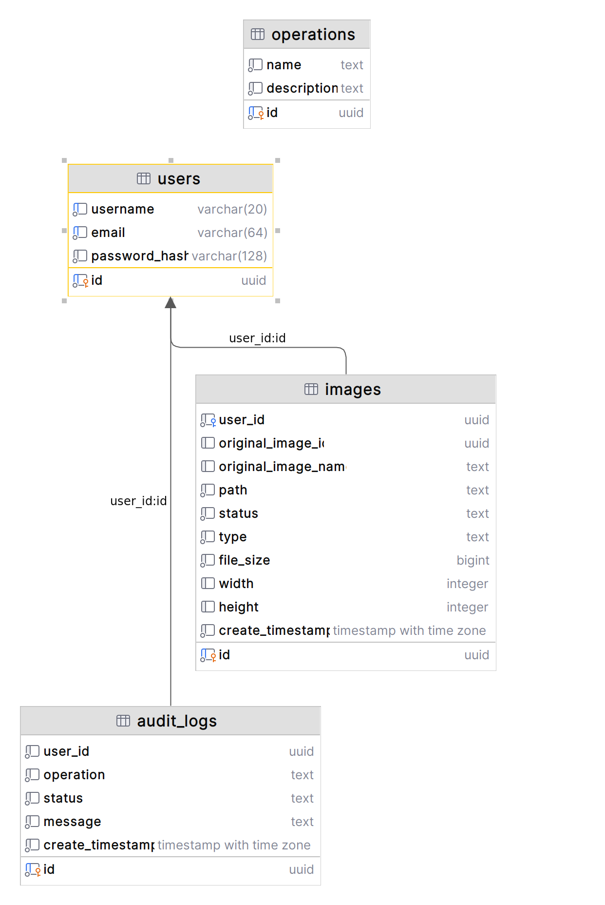

# Contribution guidelines

First off, thank you for considering contributing to **images**.

If your contribution is not straightforward, please first discuss the change you
wish to make by creating a new issue before making the change.

## Reporting issues

Before reporting an issue on the [issue tracker](https://github.com/digitalsanctum/images/issues), please check that it
has not already been reported by searching for some related keywords.

## Pull requests

Try to do one pull request per change. All tests must pass and new code must be covered by tests.

### Updating the changelog

Update the changes you have made in
[CHANGELOG](CHANGELOG.md)
file under the **Unreleased** section.

Add the changes of your pull request to one of the following subsections,
depending on the types of changes defined by
[Keep a changelog](https://keepachangelog.com/en/1.0.0/):

- `Added` for new features.
- `Changed` for changes in existing functionality.
- `Deprecated` for soon-to-be removed features.
- `Removed` for now removed features.
- `Fixed` for any bug fixes.
- `Security` in case of vulnerabilities.

If the required subsection does not exist yet under **Unreleased**, create it!

## Requirements

In order to build and test the project you'll need the following installed:

1. Java SDK 17 or above
2. Docker Compose

## Running

To run the entire project prior to exercising the API endpoints, run the following:

```shell
docker-compose up --build
```
Once the containers are up and running, you can exercise the API endpoints. See the [guide](GUIDE.md) for more details.

## Developing

### Set up

This project is a multi-project Gradle build.

In order to successfully run all the tests (unit and integration), you will need to have the database container running.
To start just the database container, run the following:

```shell
docker-compose up -d db
```

To build and test everything from the root directory, run the following:

```shell
./gradlew clean build
```

To build and test a specific project, run the following:

```shell
./gradlew :api:clean :api:build
```
or
```shell
./gradlew :worker:clean :worker:build
```

### Useful Commands

#### Quick compile (without tests)

If you just want to compile the project without running tests, run the following:

```shell
./gradlew clean build -x test
```

#### See a list of running and exited containers:

```shell
docker ps -a
```

#### Clean exited containers

In some instances, you may need to "clean" exited containers if you run into issues running `docker-compose`.

To do so, run the following:

```shell
docker system prune -f
```

## Database Schema



