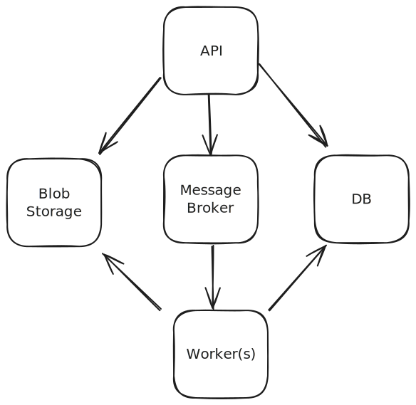

# images

A distributed async image processing service.

## Highlighted Features

* Selectable storage implementation based on Spring profiles.
* Batched image processing - perform multiple operations in a single request.
* Horizontal image processing scalability via "worker" nodes.
* Robust mime type validation via Apache Tika.
* All components are containerized and can be run locally for a great developer experience.

## Forward Looking Statements

1. **Blob Storage** - The project supports easily adding multiple storage implementations. The current implementation
   uses the file system
   for simplicity. A more robust implementation would use a cloud storage provider such as AWS S3 for durability and
   subsequently AWS CloudFront as a CDN.
2. **Supported Image Types** - Additional image types can be supported by leveraging libraries such as Apache Batik to
   support SVG.
3. **Authentication** - The authentication is a simplified version of what should be used in a production environment.
   Here a JWT
   token is used to authenticate the user. In a production environment, a more robust solution should be used such as
   OAuth2.
4. **API Documentation** - The API should be versioned and documented via OpenAPI. This would ease supporting multiple
   languages by leveraging
   code generation for clients. This would also allow for robust contract testing.
5. **Testing** - The project has a few unit and integration tests but more are warranted before being considered ready
   for production. Additional unit and integration tests should be added as well as load tests.

## Requirements

These are the requirements for running the project locally:

* Docker Compose
* curl

## Architecture



- **api** - async REST API server which serves as the entry point for the system. (Spring Boot w/Kotlin)
- **blob storage** - storage for images. (File system, S3, etc.)
- **core** - library which contains shared code between the `api` and `worker`. (Kotlin)
- **db** - relational database which stores image metadata. (PostgreSQL)
- **message broker** - messaging broker which is used for communication between the api and worker. (NATS)
- **worker** - worker which processes image processing jobs. (Spring Boot)

### Tech Stack

* Docker - containerization
* Docker Compose - container orchestration
* Kotlin - primary language
* PostgreSQL - database
* Spring Boot - web framework
* Gradle (Kotlin DSL) - build tool
* Docker - containerization
* NATS - messaging broker

## How to build and test

See: [CONTRIBUTING.md](CONTRIBUTING.md)

## How to run

```shell    
docker-compose up --build
```


